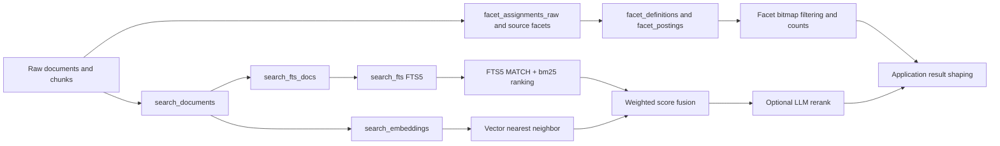
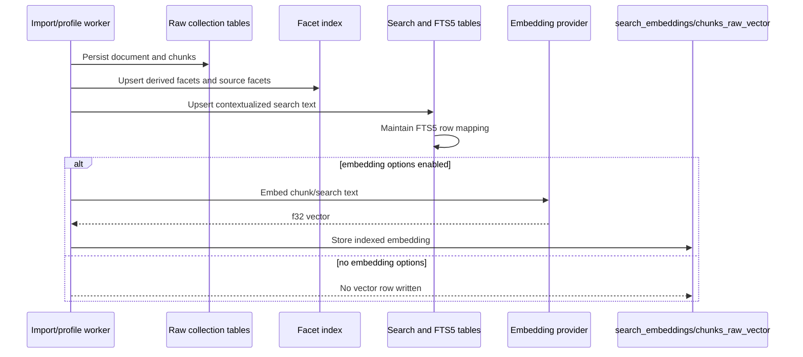
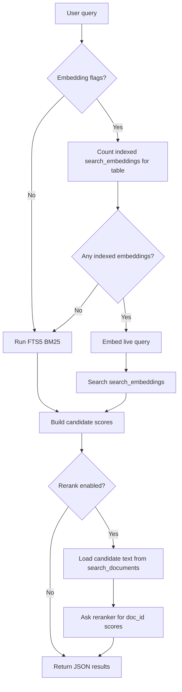
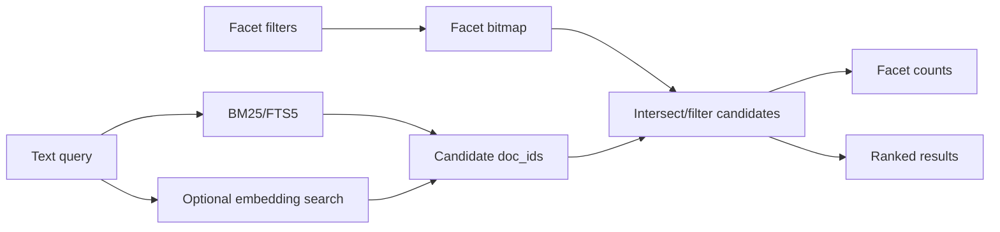

# Facets, FTS5 BM25, and Embedding Search

This document explains the SQLite standalone search stack that combines:

- facet metadata and bitmap filtering;
- FTS5 lexical search with SQLite `bm25(search_fts)`;
- optional indexed embeddings in `search_embeddings`;
- optional live query embedding and score fusion;
- optional LLM reranking.

The important operational rule is simple: **search is read-only for indexed
documents**. Document and chunk embeddings are created during import, profiling,
or an explicit batch command. A live search may embed the query, but it does not
create missing document or chunk embeddings.

## Mental Model

The system has two related but distinct index families.

| Family | Main tables | Purpose |
|--------|-------------|---------|
| Facets | `facet_tables`, `facet_definitions`, `facet_postings`, `facet_deltas` | Navigation, filtering, counts, bitmap composition |
| Search | `search_documents`, `search_fts_docs`, `search_fts`, `search_embeddings`, compact BM25 tables | Lexical search, vector search, hybrid scoring |

Facets answer "which documents/chunks match these structured dimensions?".
Search answers "which documents/chunks match this text query?". Hybrid retrieval
can use both, but the standalone CLI path documented here focuses on the search
table used by `contextual-search`.



## Indexing Flow

Indexing is where document/chunk rows become searchable. The runtime has more
than one entrypoint, but the durable contract is the same:

1. Persist raw evidence into collection tables (`documents_raw`, `chunks_raw`).
2. Derive or import facet assignments.
3. Write search text into `search_documents`.
4. Keep `search_fts_docs` and `search_fts` aligned with `search_documents`.
5. Optionally create embeddings and store them in `search_embeddings`.
6. Optionally store collection-scoped chunk vectors in `chunks_raw_vector`.



### Embedding Creation Paths

Embeddings are created before search in one of these ways:

- `document-profile-worker --contextual-retrieval --contextual-search-table-id <n> --embedding-model <model>` writes contextualized chunk text into BM25/FTS5 artifacts and writes matching embeddings.
- `search-embedding-batch --db <sqlite_path> --table-id <n> --embedding-base-url <url> --embedding-model <model> [--missing-only]` backfills `search_embeddings` for existing `search_documents` rows.
- Library code can call the same primitives directly: persist search text, call `llm.Manager.embedTexts`, then write `search_embeddings`.

Live search never backfills `search_embeddings`. This avoids unpredictable
latency, write contention, and accidental billing during reads.

## Query Flow

`contextual-search` has three search modes, selected by flags and current index
state.

| Condition | Mode | Provider call? | Output status |
|-----------|------|----------------|---------------|
| No embedding flags | BM25 only | No | `semantic_status: "not_requested"` |
| Embedding flags, but no indexed rows in `search_embeddings` | BM25 only | No | `semantic_status: "no_indexed_embeddings"` |
| Embedding flags and indexed rows exist | Hybrid BM25 + vector | Query embedding only | `semantic_status: "ok"` |



### BM25 Path

The lexical search path uses SQLite FTS5 directly:

- `search_documents` stores one logical row per searchable document/chunk ID.
- `search_fts_docs` maps logical `(table_id, doc_id)` to FTS row IDs.
- `search_fts` is an FTS5 virtual table.
- `searchFts5Bm25` runs `search_fts MATCH ?` and orders by SQLite
  `bm25(search_fts)`.

This is real FTS5 BM25, not a substring fallback.

### Embedding Path

The vector path requires indexed rows:

- `search_embeddings(table_id, doc_id, dimensions, embedding_blob)` stores
  little-endian `f32` vectors keyed to the same logical `doc_id` used by
  `search_documents`.
- `contextual-search` embeds the query only after confirming indexed embeddings
  exist for the target `table_id`.
- Vector scores are computed against the loaded `search_embeddings` rows.

JSON HTTP clients should write indexed vectors through
`POST /api/mindbrain/search-embedding-upsert` with
`{"table_id":77,"doc_id":123,"embedding":[0.1,0.2,0.3]}`. The endpoint converts
the JSON numbers to packed `f32` bytes before storing them. The generic SQL JSON
passthrough binds arrays and strings as text, so it is not a vector-blob writer.

The query embedding must use the same embedding model family as the stored
document/chunk embeddings. If models differ, vector similarity can be misleading
even though the command succeeds.

### Score Fusion

When both BM25 and vector results are available, candidates are merged by
`doc_id` and sorted by:

```text
combined_score = bm25_score * (1.0 - vector_weight) + vector_score * vector_weight
```

Default `vector_weight` is `0.5`. This is weighted score fusion, not a neural
reranker. It is fast and deterministic, but BM25 scores and vector similarity
scores are different scales, so `vector_weight` is an operational tuning knob.

## Optional LLM Reranking

LLM reranking is available only when explicitly enabled with `--rerank`.

```bash
mindbrain-standalone-tool contextual-search \
  --db data/search.sqlite \
  --table-id 77 \
  --query "How can the contract end?" \
  --base-url "$EMBED_BASE_URL" \
  --api-key "$EMBED_API_KEY" \
  --embedding-model "$EMBED_MODEL" \
  --rerank \
  --rerank-base-url "$RERANK_BASE_URL" \
  --rerank-api-key "$RERANK_API_KEY" \
  --rerank-model "$RERANK_MODEL"
```

The reranker:

1. receives the retrieved candidate IDs, fused scores, and clipped candidate
   text from `search_documents`;
2. returns JSON scores keyed by `doc_id`;
3. sorts by `rerank_score`, then by `combined_score` as the tie-breaker.

It does not replace BM25 or vector retrieval. It is a second-stage ranker over
the candidate set. Missing or unknown `doc_id`s from the LLM response are
ignored. If reranking is explicitly requested and no valid scores are returned,
the command fails instead of silently pretending reranking succeeded.

## Facets in the Retrieval Stack

Facets are the structured side of retrieval. They are not the same table family
as `search_fts` or `search_embeddings`, but they compose naturally with search:

- facet rows restrict candidate sets with bitmaps;
- facet counts support navigation and result exploration;
- vector-aware facet counting can use nearest-neighbor document IDs as a
  candidate bitmap before counting facet values;
- application-level flows can run search first, then facet/filter the result
  set, or apply facet filters before retrieving text candidates.



The current standalone CLI `contextual-search` exposes the search side. Library
consumers can combine the result IDs with facet bitmap/count helpers when they
need faceted search UX.

## Commands

### BM25 Only

No provider flags are required.

```bash
mindbrain-standalone-tool contextual-search \
  --db data/search.sqlite \
  --table-id 77 \
  --query "contract termination" \
  --limit 10
```

Expected metadata:

```json
{
  "retrieval_mode": "bm25",
  "semantic_status": "not_requested",
  "indexed_embeddings": 0,
  "rerank_enabled": false
}
```

### Backfill Embeddings

Use this when `search_documents` already exists and embeddings should be
created outside the search request path.

```bash
mindbrain-standalone-tool search-embedding-batch \
  --db data/search.sqlite \
  --table-id 77 \
  --embedding-base-url "$EMBED_BASE_URL" \
  --embedding-api-key "$EMBED_API_KEY" \
  --embedding-model "$EMBED_MODEL" \
  --missing-only
```

For an existing JSON client that already has embedding arrays, use the HTTP
upsert endpoint instead of direct SQL:

```bash
curl -fsS -X POST http://127.0.0.1:8091/api/mindbrain/search-embedding-upsert \
  -H 'content-type: application/json' \
  --data '{"table_id":77,"doc_id":123,"embedding":[0.1,0.2,0.3]}'
```

### Hybrid Search

```bash
mindbrain-standalone-tool contextual-search \
  --db data/search.sqlite \
  --table-id 77 \
  --query "contract termination" \
  --base-url "$EMBED_BASE_URL" \
  --api-key "$EMBED_API_KEY" \
  --embedding-model "$EMBED_MODEL" \
  --vector-weight 0.65 \
  --limit 10
```

If `search_embeddings` has rows for the table, expected metadata includes:

```json
{
  "retrieval_mode": "hybrid_bm25_vector",
  "semantic_status": "ok"
}
```

If no indexed embeddings exist, the command does not call the embedding
provider and returns BM25 results with:

```json
{
  "retrieval_mode": "bm25",
  "semantic_status": "no_indexed_embeddings"
}
```

## Troubleshooting

| Symptom | Likely cause | Check or fix |
|---------|--------------|--------------|
| BM25 works, vector score is always `0` | No indexed embeddings | Run `search-embedding-batch` or profile with contextual embedding flags |
| Embedding provider is not called | No indexed embeddings exist for the table | This is intentional; search does not embed the query unless vector search can run |
| Vector results look unrelated | Query and stored vectors used different models | Rebuild `search_embeddings` with the intended model |
| Rerank requested but command fails | LLM returned no valid `doc_id` scores | Inspect reranker provider/model and candidate prompt size |
| Facet counts do not match search results | Facet bitmap and search table use different logical IDs | Verify `table_id`, `doc_id` mapping, and chunk synthetic ID policy |

## Implementation Pointers

- Schema: `src/standalone/sqlite_schema.zig`
- Search persistence and FTS5 BM25: `src/standalone/search_sqlite.zig`
- CLI commands: `src/standalone/tool.zig`
- Vector BLOB encoding: `src/standalone/vector_blob.zig`
- Exact SQLite vector search: `src/standalone/vector_sqlite_exact.zig`
- Facet store and bitmap operations: `src/standalone/facet_sqlite.zig`
- LLM provider facade: `src/standalone/llm.zig`
