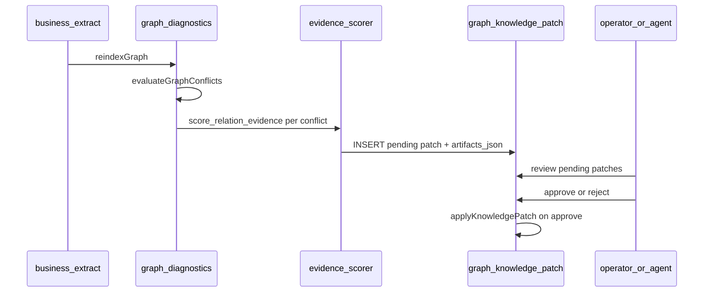

# Knowledge patch proposal pipeline

Extends `graph_knowledge_patch` from manual/approved writes to **auto-generated
pending proposals** that adjudicate graph conflicts using evidence scores.

See [graph-conflict-taxonomy.md](graph-conflict-taxonomy.md) and
[graph-conflict-diagnostics-queries.md](graph-conflict-diagnostics-queries.md).

## Current state

`graph_knowledge_patch` today:

| Field | Role |
| --- | --- |
| `patch_key` | Stable idempotency key |
| `domain` | Workspace or domain label |
| `status` | `pending` → `approved` → `applied` (or `rejected`) |
| `confidence` | Patch-level confidence |
| `artifacts_json` | Array of `upsert_entity`, `upsert_relation`, `deprecate` actions |
| `source_run` | Optional `graph_execution_run.run_key` |
| `applied_by` | Actor on approval |

`applyKnowledgePatch` in `graph_sqlite.zig` applies only **approved** patches.

## Target flow



## Schema extensions (proposed)

```sql
ALTER TABLE graph_knowledge_patch ADD COLUMN proposal_kind TEXT
  CHECK(proposal_kind IN ('manual', 'conflict_resolution', 'dedup', 'schema_filter'));

ALTER TABLE graph_knowledge_patch ADD COLUMN conflict_kind TEXT
  CHECK(conflict_kind IN (
    'mutually_exclusive', 'temporal', 'granularity', 'redundant', NULL
  ));

ALTER TABLE graph_knowledge_patch ADD COLUMN issue_fingerprint TEXT;

ALTER TABLE graph_knowledge_patch ADD COLUMN evidence_json TEXT NOT NULL DEFAULT '{}';

ALTER TABLE graph_knowledge_patch ADD COLUMN rejected_at_unix INTEGER;
ALTER TABLE graph_knowledge_patch ADD COLUMN rejected_by TEXT;
```

| Field | Meaning |
| --- | --- |
| `proposal_kind` | Why the patch was created |
| `conflict_kind` | MemGraph-style family |
| `issue_fingerprint` | Hash of `(workspace, conflict_kind, relation_ids[])` for idempotency |
| `evidence_json` | Scoring breakdown per relation (see below) |

`patch_key` format for proposals:

```
conflict::{workspace_id}::{fingerprint}
```

## Evidence scoring

For each `relation_id` in a conflict, compute `evidence_score` in `[0, 1]`:

```
evidence_score =
    0.35 * doc_ref_score +
    0.25 * chunk_link_score +
    0.20 * relation_confidence +
    0.10 * source_agreement +
    0.10 * recency_score
```

### Components

| Component | Formula |
| --- | --- |
| `doc_ref_score` | `min(1, count(distinct ref_doc_id) / 3)` from `graph_relation_property` |
| `chunk_link_score` | `min(1, count(graph_entity_chunk for source+target) / 2)` |
| `relation_confidence` | `graph_relation.confidence` |
| `source_agreement` | Share of passages where both entities co-occur (optional v2) |
| `recency_score` | `confidenceDecay` from last successful `graph_execution_run` |

### Winner selection

| Conflict kind | Default winner rule |
| --- | --- |
| `mutually_exclusive` | Highest `evidence_score`; tie → higher `relation_confidence` |
| `temporal` | Keep both if intervals can be narrowed; else higher evidence |
| `granularity` | Prefer finer `target_entity_type` per ontology parent map |
| `redundant` | Keep highest score; deprecate others |

## Proposal artifacts_json shape

```json
{
  "conflict": {
    "kind": "mutually_exclusive",
    "relation_ids": [101, 102],
    "entity_id": 42,
    "winner_relation_id": 101,
    "loser_relation_ids": [102]
  },
  "evidence": {
    "101": {
      "evidence_score": 0.82,
      "doc_ref_score": 0.67,
      "chunk_link_score": 0.5,
      "relation_confidence": 0.9
    },
    "102": {
      "evidence_score": 0.41,
      "doc_ref_score": 0.33,
      "chunk_link_score": 0.0,
      "relation_confidence": 0.7
    }
  },
  "artifacts": [
    {
      "action": "deprecate",
      "relation_type": "born_in",
      "source": "Albert Einstein",
      "target": "United States",
      "reason": "lower_evidence_score"
    }
  ]
}
```

The `artifacts` array reuses existing `applyKnowledgePatch` actions. Proposal
metadata lives alongside for audit.

## API: propose patches

### `POST /api/mindbrain/graph/conflicts/propose-patches`

Request:

```json
{
  "workspace_id": "immeuble-demo",
  "ontology_id": "immeuble-demo::core",
  "limit": 50,
  "dry_run": false,
  "conflict_kinds": ["mutually_exclusive", "temporal", "granularity", "redundant"]
}
```

Response:

```json
{
  "kind": "graph_conflict_proposal_report",
  "summary": {
    "conflicts_scanned": 12,
    "patches_created": 4,
    "patches_skipped_existing": 2
  },
  "patches": [
    {
      "patch_key": "conflict::immeuble-demo::a1b2c3",
      "status": "pending",
      "conflict_kind": "mutually_exclusive",
      "confidence": 0.82,
      "issue_fingerprint": "a1b2c3"
    }
  ]
}
```

Idempotency: if `patch_key` exists with `status IN ('pending', 'approved')`,
skip creation.

### `POST /api/mindbrain/graph/knowledge-patches/approve`

```json
{
  "patch_key": "conflict::immeuble-demo::a1b2c3",
  "applied_by": "operator@example.com"
}
```

Sets `status = 'approved'` then calls `applyKnowledgePatch`.

### `POST /api/mindbrain/graph/knowledge-patches/reject`

```json
{
  "patch_key": "conflict::immeuble-demo::a1b2c3",
  "rejected_by": "operator@example.com",
  "reason": "both_sources_valid_temporal"
}
```

## CLI (planned)

```bash
mindbrain-standalone-tool graph-conflicts-propose \
  --db data/immeuble-demo.sqlite \
  --workspace-id immeuble-demo \
  --ontology-id immeuble-demo::core \
  [--dry-run] [--format json|toon]

mindbrain-standalone-tool graph-knowledge-patch-approve \
  --db data/immeuble-demo.sqlite \
  --patch-key conflict::immeuble-demo::a1b2c3 \
  --applied-by cli
```

## GhostCrab MCP (planned)

| Tool | Maps to |
| --- | --- |
| `ghostcrab_graph_conflicts_propose` | `POST .../conflicts/propose-patches` |
| `ghostcrab_graph_knowledge_patch_list` | `GET .../knowledge-patches?status=pending` |
| `ghostcrab_graph_knowledge_patch_approve` | approve route |

## Trigger points

| Event | Action |
| --- | --- |
| After `business-extract` + reindex | Optional `--propose-conflict-patches` |
| Scheduled job / operator | `graph-conflicts-propose` |
| Before `ghostcrab_pack` (v2) | Warn if pending conflicts touch pack entities |

## Safety rules

1. Never auto-apply proposals — `pending` only until explicit approve.
2. Do not deprecate relations with `evidence_score` within 0.05 of winner
   without `severity: error` and human review flag in `metadata_json`.
3. Log `source_run` = diagnostics run key for traceability.
4. Rejected fingerprints may be stored in `metadata_json.rejected_fingerprints`
   on workspace settings to suppress repeat noise (optional).

## Related docs

- [diagnostics-and-quality.md](diagnostics-and-quality.md)
- [graph-conflict-taxonomy.md](graph-conflict-taxonomy.md)
