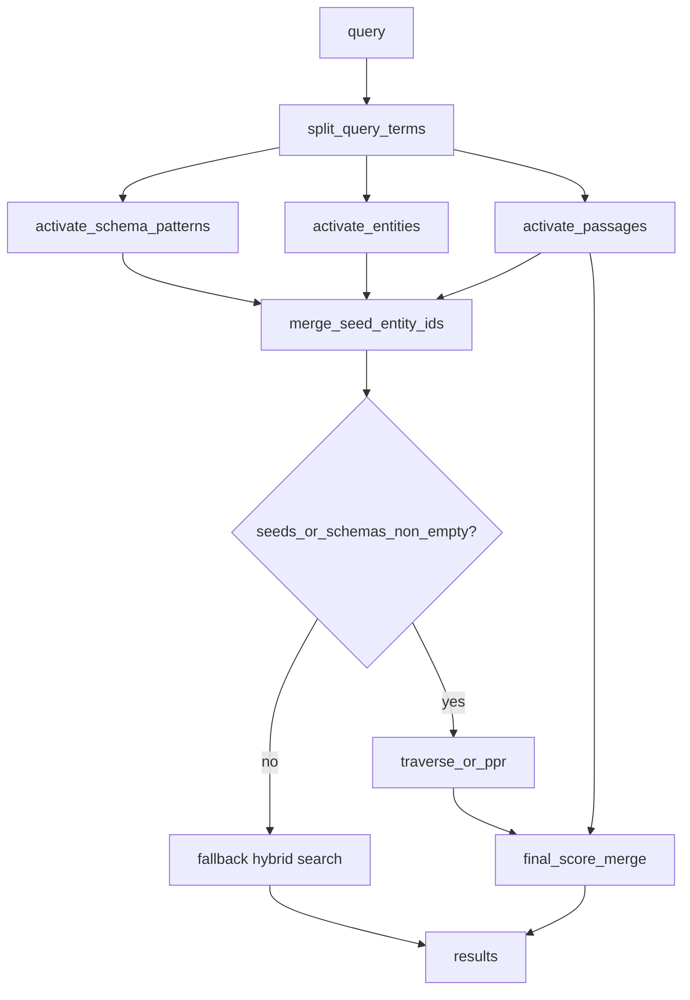

# Memory-guided recall

Unified retrieval endpoint that mirrors MemGraphRAG query-time activation:

1. **Ontology / schema layer** — match relation patterns; penalize generic types.
2. **Fact layer** — activate entities via aliases, graph search, and relation match.
3. **Passage layer** — BM25/vector on chunks and search documents linked to seeds.
4. **Graph expansion** — seed bitmap → traverse or Personalized PageRank (PPR).
5. **Fallback** — classic hybrid search when memory activation is empty.

Today MindBrain splits these across `graph-search`, `resolveTerms`,
`contextual-search`, `combined_search`, and `traverse`. This spec defines one
HTTP contract.

## Endpoint

### `POST /api/mindbrain/ghostcrab/recall`

Also exposed as CLI `mindbrain-standalone-tool recall` and MCP
`ghostcrab_recall`.

### Request

```json
{
  "workspace_id": "immeuble-demo",
  "query": "Who owns unit 12 and what lease evidence exists?",
  "ontology_id": "immeuble-demo::core",
  "collection_id": null,
  "limit": 20,
  "graph_hops": 2,
  "expansion": "traverse",
  "min_confidence": 0.3,
  "vector_weight": 0.35,
  "include_passages": true,
  "include_relations": true,
  "fallback_mode": "hybrid"
}
```

| Field | Default | Meaning |
| --- | --- | --- |
| `expansion` | `traverse` | `traverse` (BFS), `ppr` (PageRank when §13 shipped), `none` |
| `graph_hops` | 2 | Max hops for expansion |
| `min_confidence` | 0.3 | Relation filter during expansion |
| `fallback_mode` | `hybrid` | `hybrid`, `bm25`, `semantic`, `none` |

### Response

```json
{
  "kind": "memory_guided_recall_report",
  "memory_hit": true,
  "query": "...",
  "activation": {
    "schema_patterns": [
      {
        "source_entity_type": "person",
        "relation_type": "owns",
        "target_entity_type": "unit",
        "score": 0.71,
        "observation_count": 14,
        "genericity_penalty": 0.1
      }
    ],
    "entities": [
      { "entity_id": 42, "entity_type": "unit", "name": "Unit 12", "score": 0.88 }
    ],
    "passages": [
      { "doc_id": 7, "chunk_index": 2, "score": 0.65, "snippet": "..." }
    ],
    "seed_entity_ids": [42, 15]
  },
  "expansion": {
    "mode": "traverse",
    "hops_used": 2,
    "entities_discovered": 8,
    "relations_touched": 12
  },
  "results": [
    {
      "entity_id": 42,
      "entity_type": "unit",
      "name": "Unit 12",
      "final_score": 0.84,
      "match_origin": "fact_layer"
    }
  ],
  "fallback": null
}
```

When `memory_hit` is false:

```json
{
  "memory_hit": false,
  "fallback": {
    "mode": "hybrid",
    "reason": "no_schema_or_entity_activation",
    "matches": [ ... ]
  }
}
```

## Pipeline (implementation order)



## Step 1: Schema pattern activation

Input: query terms + `graph_schema_pattern_frequency` (see
[schema-pattern-frequency.md](schema-pattern-frequency.md)).

```zig
fn activateSchemaPatterns(
    db: Database,
    allocator: Allocator,
    workspace_id: []const u8,
    ontology_id: []const u8,
    query_terms: []const []const u8,
) ![]SchemaActivation
```

Score per pattern:

```
text_match = sum(term hits in relation_type, source_entity_type, target_entity_type)
schema_score = text_match * log1p(observation_count) * (1 - genericity_penalty)
```

Return top 10 patterns with `schema_score > 0`.

## Step 2: Entity activation (fact layer)

Combine:

| Source | Function | Weight |
| --- | --- | --- |
| Alias resolution | `graph_sqlite.resolveTerms` | 1.0 |
| Graph search | `graphSearchScore` (name×4, type×3, metadata×1) | 0.8 |
| Schema boost | entities matching activated patterns | +0.2 |

```zig
fn activateEntities(
    db: Database,
    allocator: Allocator,
    workspace_id: []const u8,
    query_terms: []const []const u8,
    schema_patterns: []const SchemaActivation,
    min_confidence: f32,
) ![]EntityActivation
```

Merge into `seed_entity_ids` bitmap (Roaring).

## Step 3: Passage activation

| Source | API |
| --- | --- |
| FTS5 BM25 | `search_sqlite.searchFts5Bm25` |
| Vector | `vectorRepository.searchNearestFn` when embedding present |
| Linked chunks | `graph_entity_chunk` for seed entities |

Passage score:

```
passage_score = hybrid_bm25_vector_score * density_factor
density_factor = min(1, linked_entity_count_for_chunk / 3)
```

Return top `limit * 2` passages. Add linked entity ids to seed bitmap.

## Step 4: Graph expansion

### Mode `traverse` (v1 — ships before PPR)

Reuse BFS from `graph_store.zig` / `traverseToon`:

- Seed: `seed_entity_ids`
- Filter: `min_confidence`, optional `edge_types` from activated schema patterns
- `graph_hops` limit

### Mode `ppr` (v2 — Roadmap §13)

Personalized PageRank seeded by normalized activation scores:

```
seed_weight(entity) = entity_activation_score / sum(activations)
```

Run on `graph_lj_out` / `graph_lj_in` adjacency. Defer until centrality
endpoints exist.

## Step 5: Final ranking

```
final_score(entity) =
    0.45 * entity_activation_score +
    0.30 * expansion_proximity_score +
    0.15 * max_passage_score_linked +
    0.10 * schema_pattern_boost
```

Sort descending; return top `limit`.

## Step 6: Fallback

Trigger when:

- `seed_entity_ids` empty AND `schema_patterns` empty, OR
- expansion returns zero entities

Call existing hybrid search (`fuseBm25AndVectorMatches`) on `search_documents`
/ facets. Set `memory_hit: false` and populate `fallback`.

## GhostCrab integration

`ghostcrab_combined_search` remains for graph-first + facet linked facts.
`ghostcrab_recall` is the MemGraph-aligned unified path.

Suggested operator order:

1. `ghostcrab_recall` for open questions on document corpora.
2. `ghostcrab_pack` when analysis plans and constraints matter.
3. `ghostcrab_projection_get` for frozen answer snapshots.

## CLI example

```bash
mindbrain-standalone-tool recall \
  --db data/immeuble-demo.sqlite \
  --workspace-id immeuble-demo \
  --ontology-id immeuble-demo::core \
  --query "bail unité 12" \
  --limit 10 \
  --graph-hops 2 \
  --format json
```

## Module layout (proposed)

| File | Role |
| --- | --- |
| `src/standalone/memory_recall.zig` | Pipeline orchestration |
| `src/standalone/graph_sqlite.zig` | Reuse `resolveTerms`, traverse |
| `src/standalone/search_sqlite.zig` | Passage BM25/vector |
| `src/standalone/http_app.zig` | Route handler |

## Performance budget

| Step | Target p95 (immeuble-scale) |
| --- | --- |
| Schema + entity activation | < 20 ms |
| Passage BM25 | < 50 ms |
| Traverse 2-hop | < 30 ms |
| Total | < 120 ms |

## Related docs

- [schema-pattern-frequency.md](schema-pattern-frequency.md)
- [faceted-hybrid-search.md](../faceted-hybrid-search.md)
- [queries-and-apis.md](queries-and-apis.md)
- Roadmap §13 (PageRank)
