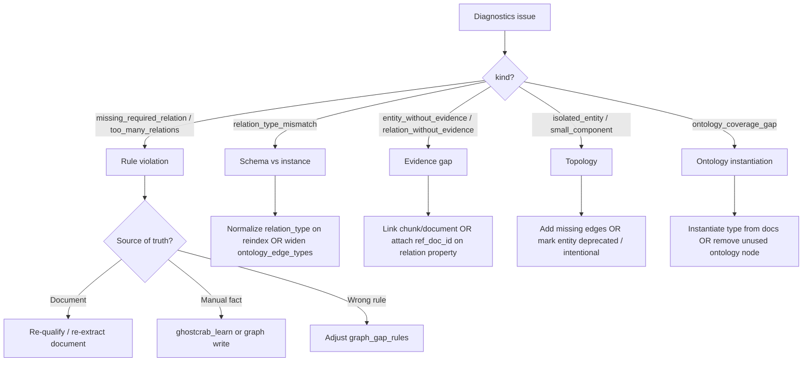

# Immeuble demo — graph gap diagnostics and remediation

This guide documents the **immeuble-demo** workspace as a reference for MindBrain
graph gap diagnostics (roadmap §9 / §9b): what each tool reveals, and how to
**remediate** issues once they are found.

Related:

- [standalone.md — Graph diagnostics shape](../../standalone.md)
- [api-reference.md — HTTP routes](../../api-reference.md)
- GhostCrab bundle README:
  `ghostcrab-personal-mcp/examples/immeuble-demo/README.md`
- Gap rules file:
  `ghostcrab-personal-mcp/examples/immeuble-demo/gap-rules.demo.json`
- Demo script: [`../../../scripts/demo-immeuble-gaps.sh`](../../../scripts/demo-immeuble-gaps.sh)

Studio copy of this document:
`sibling mindbrain-personal-studio/docs/methodology/graphing/immeuble-gap-diagnostics-demo.md`

---

## Two graphs, two semantics

| Layer | Storage | Role | Immeuble example |
|-------|---------|------|------------------|
| **Schema / ontology graph** | `ontology_entity_types`, `ontology_edge_types`, LinkML | What *may* exist (open world) | `unit`, `building`, `assigned_cellar` |
| **Instance / data graph** | `graph_entity`, `graph_relation`, evidence links | What *is* observed | `Tilleuls Appartement A3`, `Nicolas Dupont` |

**Open world (OWL / LinkML):** missing information is not automatically false.
A `unit` without `occupies` is not logically invalid.

**Closed world (syndic business):** missing information is often an anomaly.
MindBrain expresses that through **`graph_gap_rules`**, not through OWL alone.

```
LinkML ontology          →  schema (open world)
graph_gap_rules          →  closed-world contract per workspace
graph_diagnostics        →  violations + native checks
coverage                 →  ontology nodes not yet instantiated
exploration tools        →  drill-down after an issue
```

---

## Quick start (MindBrain repo)

```bash
# From mindbrain/ or mindbrain-personal-studio/ (scripts are shared)
pnpm load:immeuble                    # studio package script → load bundle + reindex
pnpm backend:immeuble               # terminal 1 — http://127.0.0.1:8092

# terminal 2
bash scripts/demo-immeuble-gaps.sh
bash scripts/demo-immeuble-gaps.sh --simulate-anomaly   # act 3 — broken cellar link
```

CLI-only (no backend):

```bash
cd mindbrain
zig build standalone-tool
bash scripts/demo-immeuble-gaps.sh --cli-only
```

**Database:** `data/immeuble-demo.sqlite`  
**Workspace:** `immeuble-demo`  
**Ontology:** `immeuble-demo::core`

After a full load you should see roughly **131** `graph_entity` rows and **265**
active `graph_relation` rows for the workspace.

---

## Tools and what they discover

All graph analysis runs in **MindBrain** (Zig). GhostCrab MCP wraps the same
HTTP JSON. Studio should consume the same contract — no duplicated logic in
TypeScript.

### 1. `ghostcrab_graph_gap_rules_import` (write)

**Purpose:** install closed-world business rules.

Imports [`gap-rules.demo.json`](../../../../ghostcrab-personal-mcp/examples/immeuble-demo/gap-rules.demo.json)
into table `graph_gap_rules`.

| rule_id | Active | Check |
|---------|--------|-------|
| `unit-one-cellar` | yes | each `unit` → exactly one `assigned_cellar` → `cellar` |
| `unit-in-building` | yes | each `unit` → ≥1 inbound `contains` (from `building` or `block`) |
| `garage-at-most-one-unit` | yes | each `parking_space` ← at most one `assigned_garage` |
| `leased-unit-has-lease` | no | optional lease contract link (enable when filtering rented units) |

**Discovery:** without imported rules, diagnostics cannot report “this unit must
have a cellar”. The ontology alone does not encode that obligation.

HTTP:

```bash
curl -sf -X POST 'http://127.0.0.1:8092/api/mindbrain/graph/gap-rules/import' \
  -H 'Content-Type: application/json' \
  -d @../ghostcrab-personal-mcp/examples/immeuble-demo/gap-rules.demo.json
```

### 2. `ghostcrab_graph_gap_rules` (read)

**Purpose:** audit the active closed-world contract.

Lists rule id, entity/relation types, direction, min/max counts, severity,
enabled flag. Use before/after changes to confirm what is being evaluated.

### 3. `ghostcrab_graph_diagnostics` (read)

**Purpose:** unified gap report — **rules + native checks**.

Returns `summary` counters and `issues[]` with `kind`, `severity`, `label`,
`suggested_action`, optional `entity_id`, `relation_id`, `rule_id`,
`observed_count`, `expected_min` / `expected_max`.

#### Native issue families (no rule required)

| kind | What it finds | Typical immeuble finding |
|------|---------------|---------------------------|
| `relation_type_mismatch` | Instance edge endpoints disagree with `ontology_edge_types` | Generic `contains` / `uses_exclusive` in data vs specialised ontology slots like `building_contains_unit` |
| `isolated_entity` | Degree 0 — no relations | e.g. **Marie Lambert** with no edges |
| `small_component` | Weakly connected component ≤ threshold | orphan micro-clusters (often info) |
| `entity_without_evidence` | Entity not linked to chunk or document | many synthetic bundle entities |
| `relation_without_evidence` | Relation has no `ref_doc_id` in properties | common on structural `contains` edges |
| `ontology_coverage_gap` | Ontology/taxonomy node not instantiated | overlaps with coverage tool |

#### Rule-driven families (after gap rules import)

| kind | What it finds |
|------|---------------|
| `missing_required_relation` | Count below `min_count` for a rule |
| `too_many_relations` | Count above `max_count` for a rule |

#### Golden data (rules loaded, graph intact)

Expect:

```text
rules_evaluated: 3
missing_required_relations: 0
cardinality_violations: 0
```

Native issues may still appear (schema/instance drift, evidence, one isolated
person). That is normal and useful for act 1 of the demo.

#### After simulated anomaly (remove cellar on Tilleuls Appartement A3)

Expect one rule violation:

```json
{
  "kind": "missing_required_relation",
  "rule_id": "unit-one-cellar",
  "entity_id": 18,
  "observed_count": 0,
  "expected_min": 1
}
```

### 4. `ghostcrab_coverage` (read)

**Purpose:** ontology/taxonomy **instantiation** gaps — “is the schema used?”

Complements diagnostics:

- **coverage** → schema nodes not reflected in facts/graph
- **gap rules** → instances that violate business invariants

On immeuble-demo, coverage may show `graph_entities: 131` with few taxonomy
`gaps` rows if facets/projections are not the primary seed path.

### 5. Exploration tools (after locating an issue)

| Tool | Use when |
|------|----------|
| `ghostcrab_graph_search` | find entities by name/type (`appartement`, `Dupont`) |
| `GET /graph/entity` | inspect facets, incident relations, evidence on `entity_id` |
| `ghostcrab_traverse` / `ghostcrab_graph_path` | follow chains (building → unit → occupant) |
| `ghostcrab_entity_chunks` | show document chunks linked to an entity |

Example context for **entity_id 18** (Tilleuls Appartement A3): occupants
(Dupont family), `owns`, garage, inbound `contains` from bloc and building,
`primary_residence_of` → household — and, after anomaly, deprecated
`assigned_cellar`.

---

## Demo narrative (15 minutes)

| Act | Action | Lesson |
|-----|--------|--------|
| 1 | diagnostics before rules | ontology ≠ validation; native mismatches and evidence gaps visible |
| 2 | import `gap-rules.demo.json` | closed-world contract; golden passes rule counters |
| 3 | remove one `assigned_cellar` | actionable `missing_required_relation` with entity id |
| 4 | scan native kinds | schema/instance drift, isolated entities, evidence |
| 5 | traverse / entity detail | connect issue to real syndic story (household, annexes) |

Map rules to [`scenarios.yaml`](../../../../ghostcrab-personal-mcp/examples/immeuble-demo/scenarios.yaml):

- `scenario:annexes` → `unit-one-cellar`, `garage-at-most-one-unit`
- structure / quota → `unit-in-building`
- `scenario:tenant-lease` → enable `leased-unit-has-lease` when ready

---

## Remediation methodology

When diagnostics reports an issue, **classify it**, then pick one remediation
track. Re-run diagnostics (and reindex if graph raw data changed) until the
issue is resolved or explicitly accepted.



### Decision table

| Issue kind | Likely root cause | First action | If documented in sources |
|------------|-------------------|--------------|---------------------------|
| `missing_required_relation` | extraction/import omitted edge | `ghostcrab_learn` or raw graph upsert + `reindex/graph` | re-run qualification/extraction on annex/register doc |
| `too_many_relations` | duplicate extraction or conflicting sources | review relations on `entity_id`; deprecate duplicate | compare source docs; merge in extraction pass |
| `relation_type_mismatch` | generic edge in instance, typed slot in ontology | align exporter/reindex to emit typed edges **or** relax ontology edge definition for legacy alias | fix LinkML → native_edge_type mapping in pipeline |
| `entity_without_evidence` | synthetic or LLM entity without provenance | link via `graph_entity_chunk` / document qualification | re-ingest supporting document |
| `relation_without_evidence` | relation property without `ref_doc_id` | add property with document reference during extraction | re-parse doc that states the link |
| `isolated_entity` | person/object never wired | add `occupies` / `household_member` / etc. | extract from registre or composition ménage doc |
| `small_component` | missing bridge relation between subgraphs | add connector edge (e.g. finance → unit) | extract from CODA / billing doc |
| `ontology_coverage_gap` | class defined but no instances | extract new entities or demote unused class | extend document corpus |

### Recommended workflow

1. **Read** `summary` — which families dominate?
2. **Pick one issue** — note `entity_id`, `relation_id`, `rule_id`.
3. **Drill down** — `GET /graph/entity`, traverse, search, chunks.
4. **Decide source of truth:**
   - **Documents** under `examples/immeuble-demo/documents/` and `sources/`
     (registre, annexes, baux, CODA, PV AG).
   - **Manual/agent fact** when no doc exists yet.
   - **Rule/ontology** when the check is wrong, not the data.
5. **Apply fix** (see tracks below).
6. **Reindex** if `entities_raw` / `relations_raw` / documents changed:
   ```bash
   node bin/gcp.mjs load examples/immeuble-demo/bundle.json \
     --workspace immeuble-demo --reindex graph   # graph only
   # or --reindex all after document/facet changes
   ```
7. **Re-run** `ghostcrab_graph_diagnostics` — confirm counters moved.
8. **Record** residual accepted gaps (e.g. intentional isolated test entities).

### Track A — Reparse / re-extract documents

Use when the fact **should** come from syndic documents but extraction missed it.

1. Identify document type via collection facets (`document_type`, building, unit).
2. Re-run document qualification + business extraction against
   `immeuble-demo::core` vocabulary (see roadmap §4–§8).
3. Apply extraction to raw graph (`entities_raw`, `relations_raw`) idempotently.
4. `POST /api/mindbrain/reindex/graph` or `gcp load … --reindex graph`.
5. Optionally attach evidence: relation properties with `ref_doc_id`, entity–chunk
   links so `entity_without_evidence` clears.

**Immeuble sources to check by scenario:**

| Scenario | Document hints |
|----------|----------------|
| Annexes (cave, garage) | `annexes-caves-garages-jardins.md`, `documents/annexes-jardins-garages.md` |
| Baux | `baux-locatifs.md`, `documents/baux-erables.md` |
| Ménages / occupants | `composition-occupants.md`, `documents/composition-menages.md` |
| CODA / finance | `coda-janvier-2026.md`, `documents/extrait-coda-janvier-2026.md` |
| Propriété | `documents/titre-propriete-tilleuls-a3.md`, registre |

### Track B — Add missing information directly

Use when you **know** the fact (agent correction, phone call, manual syndic entry)
without re-parsing a PDF.

1. MCP `ghostcrab_learn` (or HTTP fact/graph write APIs) with workspace scope
   `immeuble-demo`.
2. Upsert the missing relation with correct `relation_type` and endpoints.
3. `reindex/graph` if writes went to raw tables.
4. Re-run diagnostics.

**Act 3 reversal example** — restore cellar link without full reload:

```bash
# Prefer full reload for demo hygiene:
pnpm load:immeuble

# Or un-deprecate the relation if you kept relation_id:
sqlite3 data/immeuble-demo.sqlite \
  "UPDATE graph_relation SET deprecated_at = NULL WHERE relation_id = 55;"
```

### Track C — Fix the contract (rules or ontology)

Use when data is correct but the **check** is wrong.

| Symptom | Fix |
|---------|-----|
| Rule uses wrong `relation_type` (e.g. `part_of` vs inbound `contains`) | edit `gap-rules.demo.json` and re-import |
| Rule too broad (`person` → `owns` for all persons) | narrow `entity_type`, add metadata filter (future), or defer to §11 motif rules |
| `relation_type_mismatch` everywhere | align instance export to typed ontology edges **or** add ontology edge alias |
| Spurious `ontology_coverage_gap` | adjust taxonomy or instantiate missing class |

### Track D — Accept / defer

Some findings are informational on synthetic demos:

- `entity_without_evidence` on bundle-generated buildings — accept or link docs.
- `relation_type_mismatch` while instance graph uses generic `contains` — fix in
  §12 SHACL/compile pipeline or normalise on reindex (roadmap §10–§12).
- `leased-unit-has-lease` disabled — enable when rented-unit filter exists.

Document accepted gaps in workspace metadata or disable noisy rules.

---

## Simulate act 3 (anomaly)

```bash
export GHOSTCRAB_SQLITE_PATH="$PWD/data/immeuble-demo.sqlite"

sqlite3 "$GHOSTCRAB_SQLITE_PATH" <<'SQL'
UPDATE graph_relation
SET deprecated_at = datetime('now')
WHERE relation_id = (
  SELECT r.relation_id
  FROM graph_relation r
  JOIN graph_entity src ON src.entity_id = r.source_id
  JOIN graph_entity tgt ON tgt.entity_id = r.target_id
  WHERE r.workspace_id = 'immeuble-demo'
    AND r.relation_type = 'assigned_cellar'
    AND r.deprecated_at IS NULL
    AND src.name = 'Tilleuls Appartement A3'
    AND tgt.entity_type = 'cellar'
  LIMIT 1
);
SELECT changes() AS deprecated_edges;
SQL
```

Or: `bash scripts/demo-immeuble-gaps.sh --simulate-anomaly`

---

## MCP session checklist

```text
MINDBRAIN_HTTP_URL=http://127.0.0.1:8092
workspace_id: immeuble-demo
```

1. `ghostcrab_graph_gap_rules_import` — rules JSON
2. `ghostcrab_graph_diagnostics` — full report
3. `ghostcrab_graph_gap_rules` — audit contract
4. `ghostcrab_coverage` — ontology instantiation
5. `ghostcrab_graph_search` / `ghostcrab_traverse` — investigation

---

## Further reading

- [Roadmap.md §9–§16](../../../Roadmap.md) — delivered diagnostics and follow-up
  (topology, motifs, SHACL, link suggestion)
- [standalone.md — Graph diagnostics shape](../../standalone.md)
- [methodology/graphing/spec.md](spec.md) — Studio model vs data graph views
