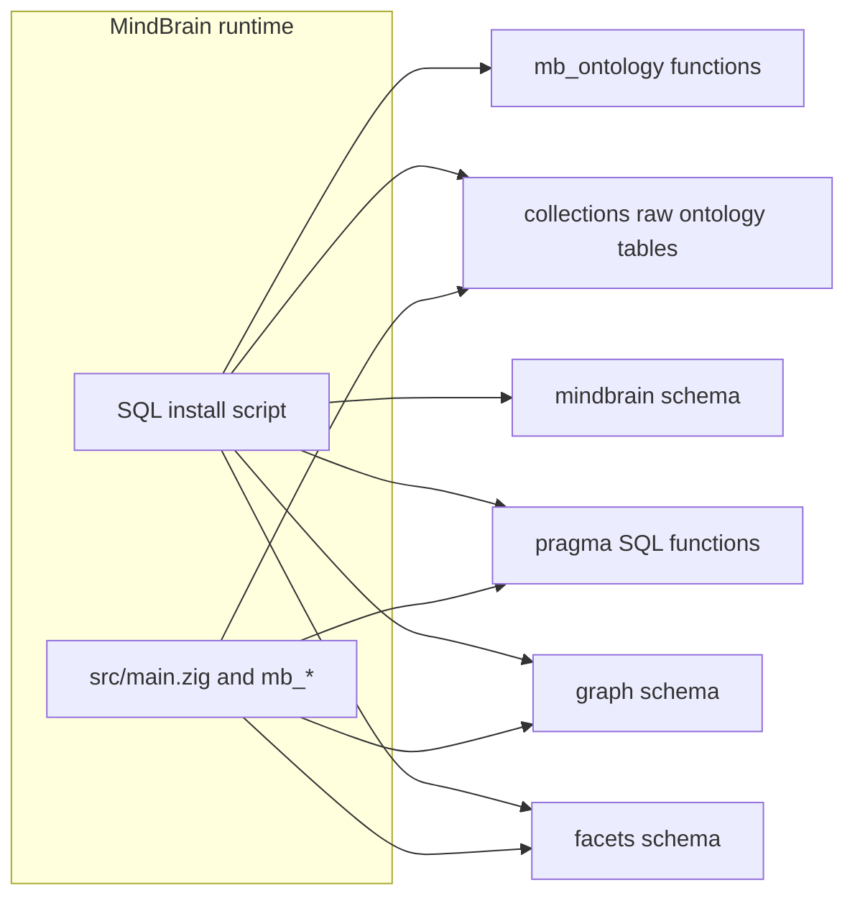

# Overview

**MindBrain** is a single SQLite-backed runtime that combines:

1. **Facets** — Roaring Bitmap–backed faceting, hierarchical facets, document search, and BM25 full-text support under the **`facets`** schema.
2. **Graph** — Typed entities, relations, alias resolution, and k-hop / shortest-path traversal using materialized bitmap adjacency indexes under the **`graph`** schema.
3. **Pragma** — SQL helpers for typed memory retrieval over `memory_projections` and related tables, plus a native Zig parser for proposition lines.
4. **Workspace registry** — Tables under **`mindbrain`** for workspaces, pending DDL, semantics, and integration with facet/graph rows via `workspace_id`.
5. **Ontology layer** — Functions in **`mb_ontology`** that join facets, graph, and projections for coverage and marketplace-style search when the optional `public.*` tables exist.

The same Zig codebase also builds a **standalone SQLite** stack (see [standalone.md](standalone.md)) for portability and tooling.
As of `v1.4.0`, the standalone search and graph stores maintain their hot
indexes incrementally for common writes and use bounded top-k selection for
vector and hybrid retrieval, so large candidate sets no longer require full
artifact rebuilds or full-result sorting on every query.

## Ontology Import

The standalone runtime now includes a first OWL2 import/export path for
normalized RDF/N-Triples:

1. `ontology-import` stores every parsed triple in `ontology_triples_raw`.
2. Simple OWL/RDFS declarations are projected into ontology entity, edge, and
   dimension tables.
3. With `--materialize-graph`, object triples are also mirrored into
   `entities_raw` / `relations_raw`.
4. `ontology-export --format ntriples` emits the preserved triples, and
   `--format bundle` emits the taxonomies bundle for a workspace.
5. Full OWL2 reasoning remains out of scope for the SQLite MVP.

The follow-up plan is [plan/2026-05-20-owl.md](plan/2026-05-20-owl.md).
The test-source directory is [source/](source/), which links to W3C OWL2
references and contains small N-Triples fixtures.

## Architecture

## Zig modules

| Module | Role |
|--------|------|
| [src/mb_facets/main.zig](../src/mb_facets/main.zig) | Native facet merge, filter bitmaps, facet counts, document search, BM25 indexing and search |
| [src/mb_graph/main.zig](../src/mb_graph/main.zig) | `k_hops_filtered_native`, `shortest_path_filtered_native` |
| [src/mb_pragma/main.zig](../src/mb_pragma/main.zig) | `pragma_parse_proposition_line`; stubs for `pragma_rank_native`, `pragma_next_hops_native` |
| [src/standalone/](../src/standalone/) | SQLite stores, hybrid search, graph streaming, CLI and HTTP tools |

## Version

The bundled facet layer reports **`0.4.2`** via `facets._get_version()` inside the SQL install script. The control file uses **`default_version = 1.0.0`** for the unified distribution.

## Requirements

- **Required:** the bundled runtime dependencies used by the SQLite and native graph/facet layers.
- **Optional:** **`vector`** support for embedding-related features when those tables are present. See [installation.md](installation.md).
