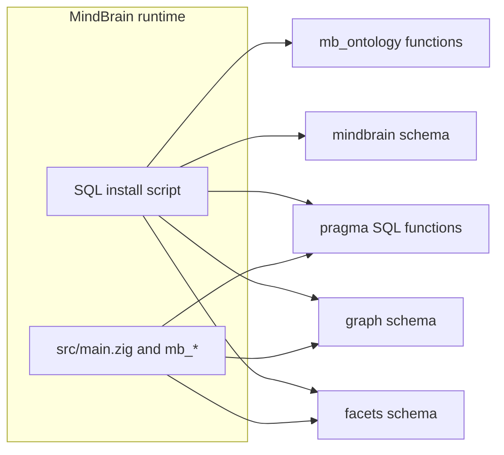

# Overview

**MindBrain** is a single SQLite-backed runtime that combines:

1. **Facets** — Roaring Bitmap–backed faceting, hierarchical facets, document search, and BM25 full-text support under the **`facets`** schema.
2. **Graph** — Typed entities, relations, alias resolution, and k-hop / shortest-path traversal using materialized bitmap adjacency indexes under the **`graph`** schema.
3. **Pragma** — SQL helpers for typed memory retrieval over `memory_projections` and related tables, plus a native Zig parser for proposition lines.
4. **Workspace registry** — Tables under **`mindbrain`** for workspaces, pending DDL, semantics, and integration with facet/graph rows via `workspace_id`.
5. **Ontology layer** — Functions in **`mb_ontology`** that join facets, graph, and projections for coverage and marketplace-style search when the optional `public.*` tables exist.

The same Zig codebase also builds a **standalone SQLite** stack (see [standalone.md](standalone.md)) for portability and tooling.

## Architecture

## Zig modules

| Module | Role |
|--------|------|
| [src/mb_facets/main.zig](../src/mb_facets/main.zig) | Native facet merge, filter bitmaps, facet counts, document search, BM25 indexing and search |
| [src/mb_graph/main.zig](../src/mb_graph/main.zig) | `k_hops_filtered_native`, `shortest_path_filtered_native` |
| [src/mb_pragma/main.zig](../src/mb_pragma/main.zig) | `pragma_parse_proposition_line`; stubs for `pragma_rank_native`, `pragma_next_hops_native` |
| [src/standalone/](../src/standalone/) | SQLite stores, hybrid search, CLI tool |

## Version

The bundled facet layer reports **`0.4.2`** via `facets._get_version()` inside the SQL install script. The control file uses **`default_version = 1.0.0`** for the unified distribution.

## Requirements

- **Required:** the bundled runtime dependencies used by the SQLite and native graph/facet layers.
- **Optional:** **`vector`** support for embedding-related features when those tables are present. See [installation.md](installation.md).
