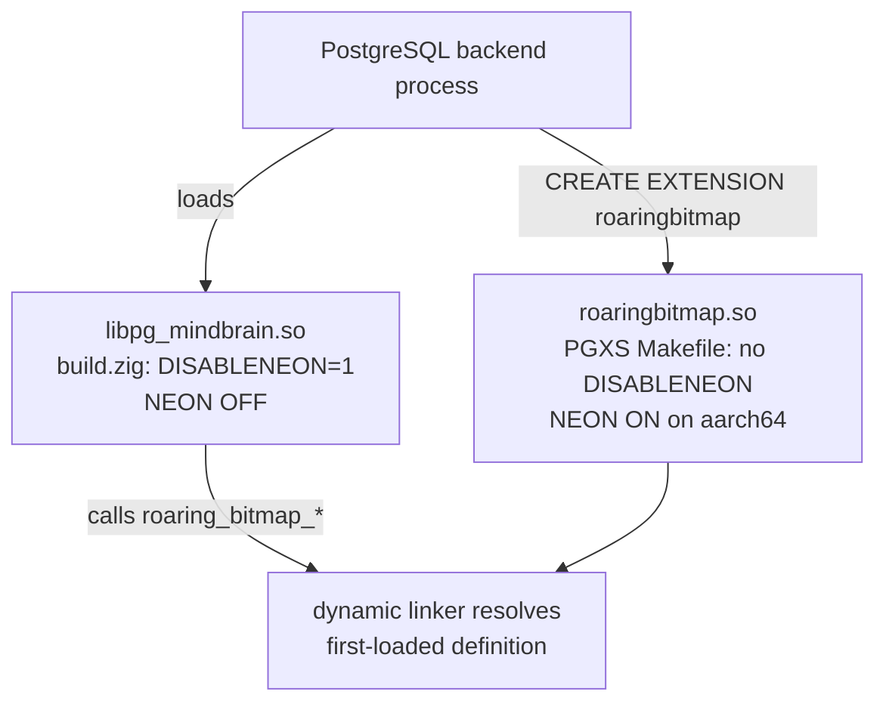

# RoaringBitmap Mac / ARM64 NEON — Audit & Upgrade Plan

## Toolchain prerequisite

[`build.zig`](build.zig) line 17 already enforces Zig 0.16.0 via `requireZig(.{ .major = 0, .minor = 16, .patch = 0 })`. System default is 0.15.2 — **all build invocations must use `/usr/local/bin/zig-0.16`** (or `PATH=/usr/local/...:$PATH zig build`). Verify before any work:

```bash
zig-0.16 version   # must print 0.16.0
```

## Key facts from the audit

- Vendored CRoaring: **4.3.11** (Sept 2025) | Upstream available at `/home/dlamotte/Documents/external/CRoaring/`: **4.7.0** (four minor releases ahead).
- NEON in CRoaring is **compile-time only** on ARM. There is **no** ARM runtime dispatch — `croaring_hardware_support()` is x86-only in both 4.3.11 and 4.7.0 (the function body sits inside `#if defined(__x86_64__) || defined(_M_AMD64)` and is absent on AArch64).
- NEON is mandatory on all ARMv8-A CPUs, so the M1 crash is **not** a "CPU lacks NEON" issue — it is a **CRoaring bug** in the NEON code path.
- The existing `module.addCMacro("DISABLENEON", "1")` in [`build.zig`](build.zig) line 302 is a **workaround** that bypasses the NEON path entirely.

## Why true runtime NEON detection is not practical

CRoaring's x86 runtime dispatch uses CPUID + compiler `target_attribute` regions to compile AVX2 and AVX-512 alongside scalar code in the same DSO. It does **not** offer the equivalent for NEON. To get "compile both NEON and non-NEON, pick at runtime" we would have to:

1. Build `roaring.c` twice with different macros into separate object files
2. Use symbol versioning or per-call dispatch tables
3. Add an ARM-side `croaring_hardware_support()`

This is a non-trivial fork of CRoaring. The pragmatic equivalent is a **build-time `-Dneon`** flag plus, if needed, an **environment variable override** read at extension load time. This plan implements the build-time flag.

## How NEON gets activated (crash mechanism)

[`deps/pg_roaringbitmap/roaring.h`](deps/pg_roaringbitmap/roaring.h) lines 216–221:
```c
#if !defined(CROARING_USENEON) && !defined(DISABLENEON) && defined(__ARM_NEON)
#define CROARING_USENEON
#endif
```
Any translation unit that includes `roaring.h` on AArch64 **without** `-DDISABLENEON=1` compiles in NEON intrinsic paths. If those paths have a bug (4.3.11 on M1), execution crashes at runtime, not at compile time.

## Two-DSO problem



`roaring_buffer_reader.c` line 9: `#include "roaring.c"` — the PGXS build compiles the full CRoaring amalgamation into `roaringbitmap.so`. Both `.so` files export the same CRoaring symbols; the dynamic linker picks one, so a single `roaring_bitmap_intersect()` call can be resolved to the NEON-built copy even when called from the Zig DSO. **This is the most likely silent crash vector on M1.**

---

## Step 1 — Upgrade amalgamation to CRoaring 4.7.0

Source: `/home/dlamotte/Documents/external/CRoaring/amalgamation.sh`

```bash
cd /home/dlamotte/Documents/external/CRoaring
bash amalgamation.sh /tmp/croaring-470
cp /tmp/croaring-470/roaring.c \
   /home/dlamotte/Documents/mindflight/pg_mindbrain/deps/pg_roaringbitmap/roaring.c
cp /tmp/croaring-470/roaring.h \
   /home/dlamotte/Documents/mindflight/pg_mindbrain/deps/pg_roaringbitmap/roaring.h
```

Files replaced: [`deps/pg_roaringbitmap/roaring.c`](deps/pg_roaringbitmap/roaring.c), [`deps/pg_roaringbitmap/roaring.h`](deps/pg_roaringbitmap/roaring.h). `roaringbitmap.c/.h` and SQL scripts belong to `pg_roaringbitmap` (not CRoaring) and are untouched.

After replacement, verify the new header banner shows `ROARING_VERSION "4.7.0"` and the file generation timestamp is fresh.

---

## Step 2 — Add `-Dneon` option in `build.zig`

[`build.zig`](build.zig) currently has three call sites that need touching:
- Line 28: `createProjectModule(... "src/main.zig")` — main extension DSO
- Line 42: `createProjectModule(... "src/pg_check.zig")` — pg-check object
- Lines 299–307: `configureCroaring(mod)` — single arg today

Add a top-level type, a `b.option` in `build()`, and thread it through. Concrete Zig 0.16 patch:

```zig
const NeonMode = enum { auto, on, off };

pub fn build(b: *std.Build) void {
    requireZig(.{ .major = 0, .minor = 16, .patch = 0 });

    const target = b.standardTargetOptions(.{});
    const optimize = b.standardOptimizeOption(.{});
    const neon = b.option(
        NeonMode,
        "neon",
        "ARM NEON support: auto (off on aarch64 until 4.7.0 verified on M1), on, off",
    ) orelse .auto;
    // ... existing code ...
    const root_mod = createProjectModule(b, target, optimize, ztoon_mod, neon, "src/main.zig");
    // ... and pass `neon` to the pg_check createProjectModule call as well ...
}

fn createProjectModule(
    b: *std.Build,
    target: std.Build.ResolvedTarget,
    optimize: std.builtin.OptimizeMode,
    ztoon_mod: *std.Build.Module,
    neon: NeonMode,
    root_source: []const u8,
) *std.Build.Module {
    const mod = b.createModule(.{ ... });
    configureCroaring(mod, target, neon);
    // ... existing body ...
}

fn configureCroaring(module: *std.Build.Module, target: std.Build.ResolvedTarget, neon: NeonMode) void {
    module.addIncludePath(.{ .cwd_relative = "deps/pg_roaringbitmap" });
    module.addCMacro("CROARING_COMPILER_SUPPORTS_AVX512", "0");
    const disable_neon = switch (neon) {
        .off => true,
        .on  => false,
        .auto => true, // conservative: keep current behavior until 4.7.0 is verified on real M1
    };
    if (disable_neon) module.addCMacro("DISABLENEON", "1");
    module.addCSourceFile(.{
        .file = .{ .cwd_relative = "deps/pg_roaringbitmap/roaring.c" },
        .flags = &.{},
    });
}
```

Usage:
- `zig-0.16 build` → NEON **off** (auto default, preserves today's behavior)
- `zig-0.16 build -Dneon=on` → NEON **on** (for the verification step on M1)
- `zig-0.16 build -Dneon=off` → explicit off (CI / production until verified)

**Note on `@cImport` macro propagation:** Zig 0.16 propagates `module.addCMacro` to translate-c (`@cImport`) for all `.zig` files in the module, so the explicit `@cDefine("DISABLENEON","1")` inside [`src/mb_facets/utils.zig`](src/mb_facets/utils.zig) line 28–29 and [`src/mb_graph/utils.zig`](src/mb_graph/utils.zig) line 18–19 is **not** required. The previous plan over-engineered this; `addCMacro` is the single source of truth.

---

## Step 3 — Patch the PGXS Makefile (the actual crash vector)

[`deps/pg_roaringbitmap/Makefile`](deps/pg_roaringbitmap/Makefile) line 8 currently:
```makefile
$(OBJS): override CFLAGS += -std=c11 -Wno-error=maybe-uninitialized \
	-Wno-declaration-after-statement -Wno-missing-prototypes
```
Change to:
```makefile
$(OBJS): override CFLAGS += -DDISABLENEON=1 -std=c11 -Wno-error=maybe-uninitialized \
	-Wno-declaration-after-statement -Wno-missing-prototypes
```
Same edit applies to [`Makefile_native`](deps/pg_roaringbitmap/Makefile_native) line 8 (vendor alternative — low priority, but a one-line edit for symmetry).

**Why not pass via `make CFLAGS=...`?** The Makefile uses `override CFLAGS +=`, which defeats command-line `CFLAGS=`. The patch must be in the Makefile itself.

**Docker propagation:** [`docker/Dockerfile`](docker/Dockerfile) line 50 does `COPY deps/` before `make` (line 58), so the patched local Makefile is used. **No Dockerfile change needed** for the main image. Only [`examples/golang/facets/Dockerfile.test`](examples/golang/facets/Dockerfile.test) (lines 60–68) and [`examples/golang/graph/Dockerfile.test`](examples/golang/graph/Dockerfile.test) (lines 65–69) clone upstream `pg_roaringbitmap` and need a post-clone `sed` or a pre-applied patch.

---

## Step 4 — Verification on real M1 (one-way door)

This is the only way to know if 4.7.0 fixes the M1 crash. Do it AFTER Steps 1–3 land:

1. `zig-0.16 build` — confirm baseline still passes (NEON off, preserves current behavior)
2. `zig-0.16 build -Dneon=on` on M1 — runtime smoke test of the bitmap-heavy paths in [`src/mb_facets/bm25/roaring_index.zig`](src/mb_facets/bm25/roaring_index.zig) and [`src/mb_graph/graph_traversal.zig`](src/mb_graph/graph_traversal.zig)
3. If green: flip the `.auto` default in `configureCroaring` to `target.result.cpu.arch != .aarch64` so AArch64 gets NEON by default
4. If still crashes: file an upstream CRoaring issue; keep `.auto = disable_neon = true` indefinitely

---

## Step 5 — Remove dead duplicate weak symbol (MINOR)

[`src/mb_facets/filter_helper.c`](src/mb_facets/filter_helper.c) lines 150–157: the `__attribute__((weak)) int croaring_hardware_support()` block is dead — this file is **not** added to [`build.zig`](build.zig). The live copy is in [`src/common/helper.c`](src/common/helper.c) lines 181–185. Remove the duplicate block to prevent future confusion.

---

## Summary

| # | Severity | Action | Files |
|---|----------|--------|-------|
| 1 | REQUIRED | Upgrade CRoaring 4.3.11 → 4.7.0 via `amalgamation.sh` | `deps/pg_roaringbitmap/roaring.c`, `roaring.h` |
| 2 | REQUIRED | Add `NeonMode` enum + `-Dneon` option in `build.zig`; thread through both `createProjectModule` calls; default `.auto = off` (conservative) | `build.zig` |
| 3 | CRITICAL | Append `-DDISABLENEON=1` to `override CFLAGS +=` in PGXS Makefile (closes two-DSO crash vector) | `deps/pg_roaringbitmap/Makefile`, optionally `Makefile_native` |
| 4 | REQUIRED | Verify on real Apple Silicon M1 with `-Dneon=on`; flip auto default only if green | host build + `psql` smoke test |
| 5 | MINOR | Remove dead weak symbol block | `src/mb_facets/filter_helper.c` |

## Out of scope (deliberate)

- `@cImport` explicit `@cDefine` — Zig 0.16 `addCMacro` propagates correctly; redundant.
- `Makefile_native` — vendor alternative, not used by this repo's build.
- Example `Dockerfile.test` patches — examples, not production. Can be done as a follow-up.
- True runtime NEON dispatch — not feasible without forking CRoaring.
